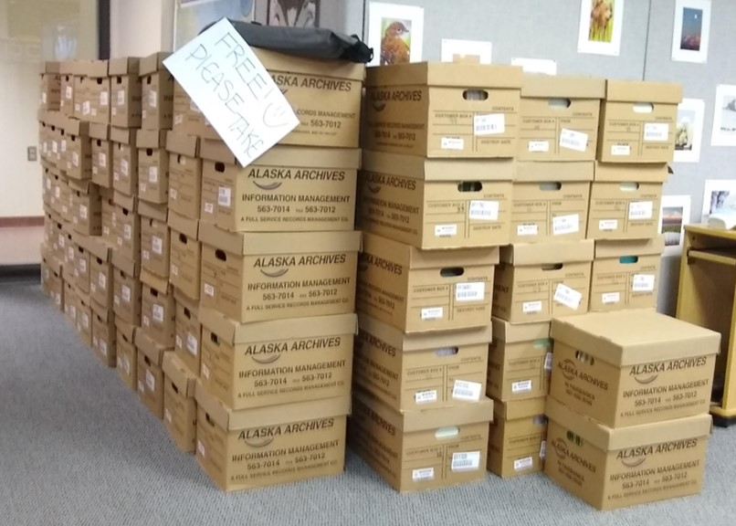
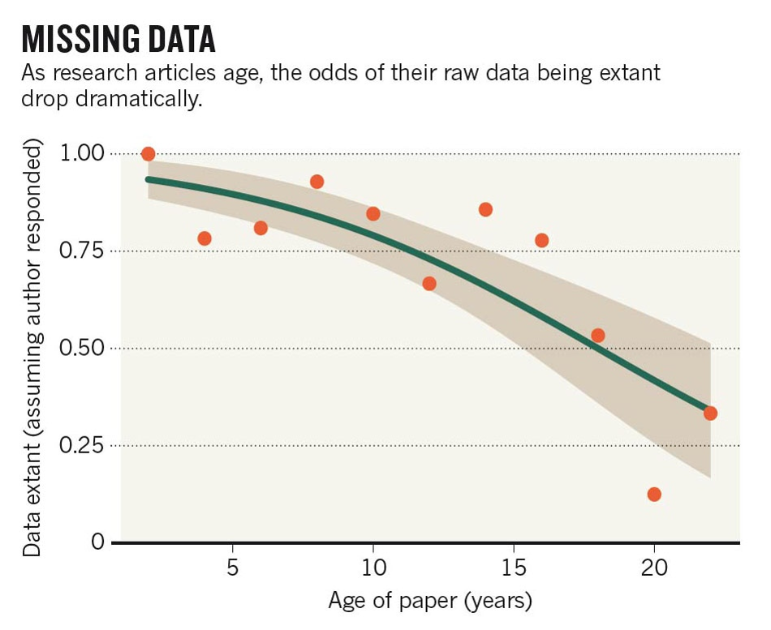

```{r setup, include=FALSE}
knitr::opts_chunk$set(echo = FALSE)
```


```{r xaringan-themer, include = FALSE}

# devtools::install_github("gadenbuie/xaringanthemer")
#library(xaringanthemer)
# mono_light(
#   base_color = "#1c5253",
#   header_font_google = google_font("Josefin Sans"),
#   text_font_google   = google_font("Montserrat", "300", "300i"),
#   code_font_google   = google_font("Droid Mono")
# )
```


background-image: url("images/arctic_village.jpg")
# First off........THANK YOU!!

???
- Thank you for stepping up and "volunteering" to be an early adopter of the new process for archiving data in Alaska region. You are leading the way!


---
# A quick overview
 
 .left-column[

]
 
.right-column[
### Data management efforts in the region
]

???
This short presentation will provide you all with a short history of data management efforts in the region
- The reason for giving you this (other than data management is quite exciting!) is that you will start to see how your work as an early adopter fit into the larger strategy for data management in Alaska and nationally.


---
# A quick overview

.left-column[

]

.right-column[
### Data management efforts in the region
### How these efforts relate to you as an **Early Adopter**
]

???
The second piece that you might want to know is how data management efforts relate to your efforts as an 
early adopter.


---
# A quick overview

.left-column[

]

.right-column[
### Data management efforts in the region
### How these efforts relate to you as an **Early Adopter**
### What to expect as an *Early Adopter*
]

???
Finally, we will get into what the expectations are of being an early adopter. In other words, what is the next year going to look like?


---
background-image: url("images/tell_us_about_project.png")

???
Before we get started though, let take a moment for you to tell the group about who you are and the project that you selected as an Early Adopter.


---
# Grassroots

--

.center[]

???
The recent FWS data management movement (if you want to call it that) is rooted in concerns from both leadership and the field. Therefore, you can think of it as both a grassroots effort and a top-down effort. 


---
# Grassroots

.center[]


---
# Top-down
.center[]

???


---
background-image: url("images/early_adopters.png")
background-size: contain


---
# **Tools and Guidance**
 
```{r echo=FALSE, out.width="35%"}
knitr::include_graphics("images/mdeditor.png")
```

--

### [Alaska Region ***Interim**** Data Management User Guide](https://ak-region-dst.gitbook.io/alaska-region-interim-data-management-user-guide/)

--

### [Alaska Region ***Interim**** Metadata   Guide](https://ak-region-dst.gitbook.io/alaska-region-mdeditor-interim-user-guide/)

--

### [Early Adopter Microsoft   Team](https://teams.microsoft.com/l/team/19%3a4b44ca0cecc147f287591f25f55a3a6b%40thread.skype/conversations?groupId=f2bccb15-7613-446e-9cd2-ce1cf171f5d5&tenantId=0693b5ba-4b18-4d7b-9341-f32f400a5494)

<br>
<br>

<font size="4"> *Your help is needed! </font>
