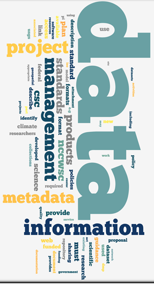

```{r setup, include=FALSE}
knitr::opts_chunk$set(echo = FALSE)
```


```{r xaringan-themer, include = FALSE}

# devtools::install_github("gadenbuie/xaringanthemer")
#library(xaringanthemer)
# mono_light(
#   base_color = "#1c5253",
#   header_font_google = google_font("Josefin Sans"),
#   text_font_google   = google_font("Montserrat", "300", "300i"),
#   code_font_google   = google_font("Droid Mono")
# )
```

background-image: url("images/arctic_village.jpg")
# First off........THANK YOU!!

???
- Thank you for stepping up and "volunteering" to be an early adopter of the new process for archiving data in Alaska region. You are leading the way!

---
# A quick overview
 
 .left-column[

]
 
.right-column[
### Data management efforts in the region
]

???
This short presentation will provide you all with a short history of data management efforts in the region
- The reason for giving you this (other than it is quite exciting!) is that you will start to see how your work as an early adopter fit into the larger strategy for data management in Alaska and nationally.

---
# A quick overview

.left-column[

]

.right-column[
### Data management efforts in the region
<br>
### How these efforts relate to you as an **Early Adopter**
]

---
# A quick overview

.left-column[

]

.right-column[
### Data management efforts in the region
<br>
### How these efforts relate to you as an **Early Adopter**
<br>
### What to expect
]

---
background-image: url("images/tell_us_about_project.png")


---
background-image: url("images/fws_dm_movement.jpg")
background-size: contain

---
background-image: url("images/early_adopters.png")
background-size: contain

---
# **Tools and Guidance**
 
```{r echo=FALSE, out.width="35%"}

```

--

### [Alaska Region ***Interim**** Data Management User Guide](https://ak-region-dst.gitbook.io/alaska-region-interim-data-management-user-guide/)

--

### [Alaska Region ***Interim**** Metadata   Guide](https://ak-region-dst.gitbook.io/alaska-region-mdeditor-interim-user-guide/)

--

### [Early Adopter Microsoft   Team](https://teams.microsoft.com/l/team/19%3a4b44ca0cecc147f287591f25f55a3a6b%40thread.skype/conversations?groupId=f2bccb15-7613-446e-9cd2-ce1cf171f5d5&tenantId=0693b5ba-4b18-4d7b-9341-f32f400a5494)

<br>
<br>

<font size="4"> *Your help is needed! </font>
