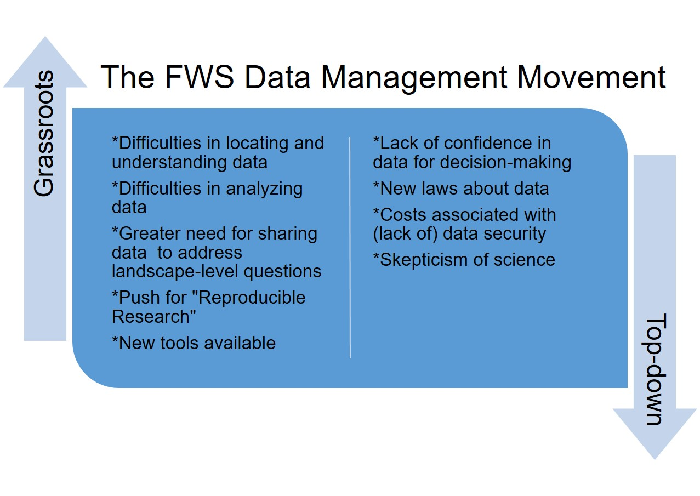
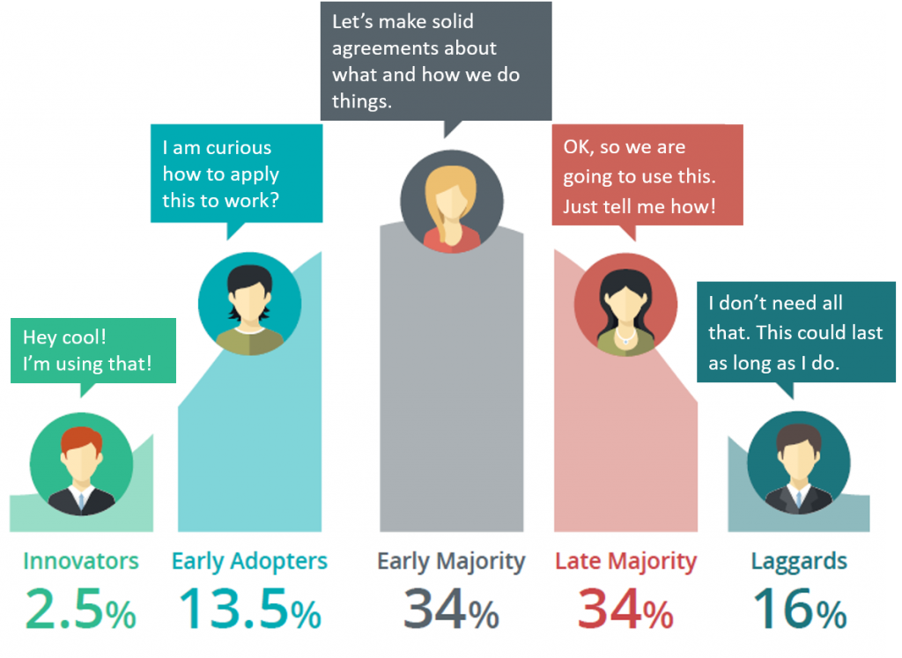

```{r setup, include=FALSE}
knitr::opts_chunk$set(echo = FALSE)
```

## {data-background="images/arctic_village.jpg"}
<center>
<h1> Refuge Data Management Early Adopters <h1>
</center>

## 
<h1>First off...
<br>
<br>
***...THANK YOU!***


## **Quick overview**
- Some background on data management efforts in the region

- How these efforts relate to you as an **Early Adopter**

- What to expect


## 
{width=100%}


##
{width=100%}


## **Tools and Guidance for Early Adopters**
<br>
[{width=40%}](https://www.mdeditor.org/)

- [Alaska Region ***Interim**** Data Management User Guide](https://ak-region-dst.gitbook.io/alaska-region-interim-data-management-user-guide/)

- [Alaska Region ***Interim**** Metadata   Guide](https://ak-region-dst.gitbook.io/alaska-region-mdeditor-interim-user-guide/)

- [Early Adopter Microsoft   Team](https://teams.microsoft.com/l/team/19%3a4b44ca0cecc147f287591f25f55a3a6b%40thread.skype/conversations?groupId=f2bccb15-7613-446e-9cd2-ce1cf171f5d5&tenantId=0693b5ba-4b18-4d7b-9341-f32f400a5494)

<br>
<br>
<font size="4"> *Your help is needed! </font>


